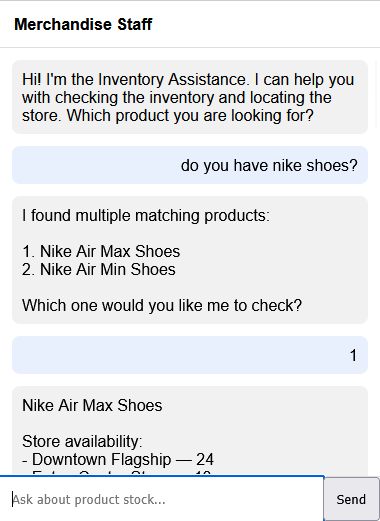
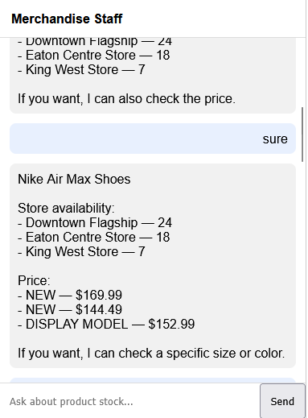
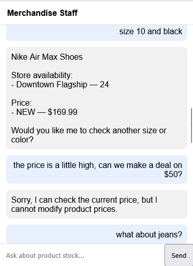
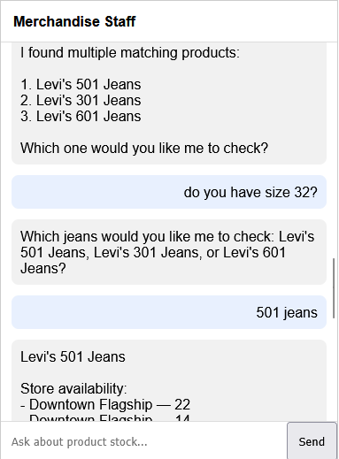
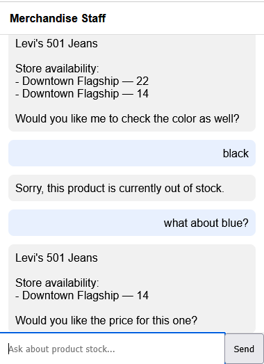
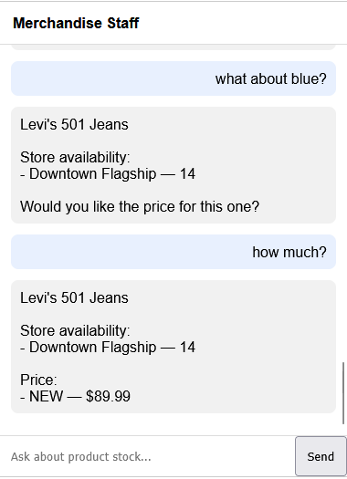

- Run: docker compose up --build
- Insert test data:  docker compose exec backend python -m app.test_data
- pgAdmin: http://localhost:5050
  * Login: admin@test.com & admin
  * Add server:
    * Host: postgres
    * Port: 5432
    * Database: merch_db
    * Username: admin
    * Password: admin
- Stop: docker compose down -v
- Clear browser session: 
  * localStorage.removeItem("chat_messages"); 
  * localStorage.removeItem("chat_session_id")

